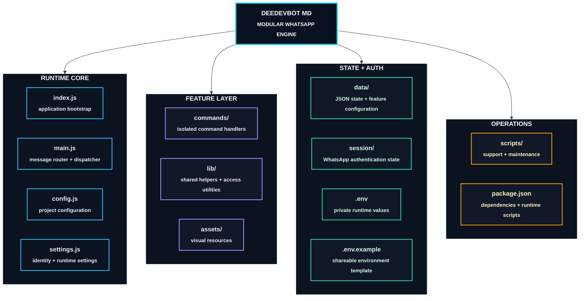

<!-- ============================================================ -->
<!--                 DEEDEVBOT MD // PREMIUM CORE                -->
<!-- ============================================================ -->

<p align="center">
  
</p>

<p align="center">
  
</p>

<p align="center">
  
</p>

<p align="center">
  
</p>

<p align="center">
  
  
  
  
</p>

<p align="center">
  
  
  
</p>

<p align="center">
  <a href="https://whatsapp.com/channel/0029VbBV8Lq5q08UdpLG6J2F">
    
  </a>
  <a href="https://wa.me/255610783183?text=Hello%2C%20I%20want%20to%20request%20the%20DeeDevBot-MD%20file.">
    
  </a>
  <a href="https://youtu.be/Z9fjYETNeBg?si=WCvKWS8xhyc3qui2">
    
  </a>
</p>

<p align="center">
  
</p>

<p align="center">
  
</p>

<!-- ============================================================ -->
<!-- SYSTEM DNA -->
<!-- ============================================================ -->

<p align="center">
  
</p>

<p align="center">
  
</p>

<p align="center">
  
  
  
  
  
</p>

<p align="center">
  
</p>

<p align="center">
  
</p>

<!-- ============================================================ -->
<!-- COMMAND VAULT -->
<!-- ============================================================ -->

<p align="center">
  
</p>

<p align="center">
  
</p>

<p align="center"></p>
<p align="center"></p>
<p align="center"></p>

<p align="center"></p>
<p align="center"></p>
<p align="center"></p>

<p align="center"></p>
<p align="center"></p>
<p align="center"></p>

<p align="center"></p>
<p align="center"></p>
<p align="center"></p>

<p align="center"></p>
<p align="center"></p>
<p align="center"></p>

<p align="center"></p>
<p align="center"></p>
<p align="center"></p>

<p align="center"></p>
<p align="center"></p>
<p align="center"></p>

<p align="center"></p>
<p align="center"></p>
<p align="center"></p>

<p align="center"></p>
<p align="center"></p>
<p align="center"></p>

<p align="center"></p>
<p align="center"></p>

<p align="center"></p>
<p align="center"></p>

<p align="center"></p>
<p align="center"></p>

<p align="center">
  
</p>

<!-- ============================================================ -->
<!-- ARCHITECTURE -->
<!-- ============================================================ -->

<p align="center">
  
</p>

<p align="center">
  
</p>



<p align="center">
  
</p>


<p align="center">
  
</p>

<p align="center">
  
</p>

<!-- ============================================================ -->
<!-- LAUNCH -->
<!-- ============================================================ -->

<p align="center">
  
</p>

<p align="center"></p>

```bash
git clone <YOUR_REPOSITORY_URL>
cd DeeDevBot-MD
```

<p align="center"></p>

```bash
npm install
```

<p align="center"></p>

```text
.env
settings.js
config.js
```

```env
OWNER_NUMBER=255XXXXXXXXX
```

<p align="center"></p>

```bash
node index.js
```

<p align="center">
  
</p>

<p align="center">
  
</p>

<!-- ============================================================ -->
<!-- SECURITY -->
<!-- ============================================================ -->

<p align="center">
  
</p>

<p align="center">
  
</p>

<p align="center">
  
  
  
  
</p>

<p align="center">
  
</p>

<p align="center">
  
</p>

<!-- ============================================================ -->
<!-- PRINCIPLES -->
<!-- ============================================================ -->

<p align="center">
  
</p>

<p align="center"></p>
<p align="center"></p>
<p align="center"></p>
<p align="center"></p>
<p align="center"></p>

<p align="center">
  
</p>

<p align="center">
  
</p>

<p align="center">
  
</p>

<p align="center">
  
</p>
